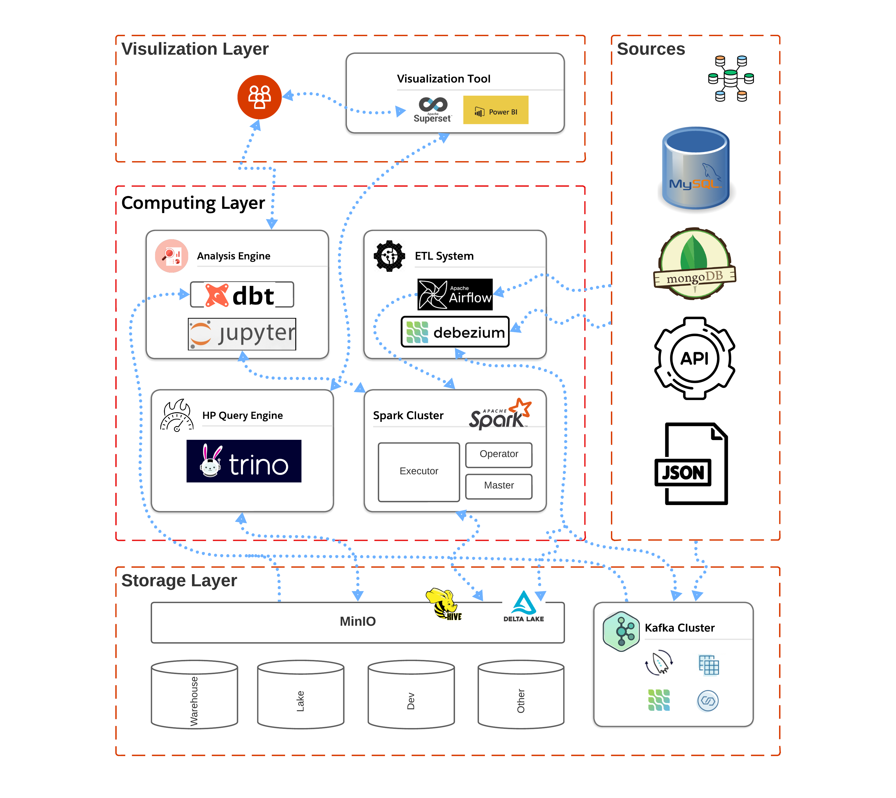

    

        <li>
            
        </li>
    

To kickstart the development of such a system, the first step is to design the data architecture depending on the project's requirements. For the project I'm involved in, the system needs to handle data from various sources in two main formats: real-time data processing and batch processing. A comprehensive diagram of the data pipeline is presented below to illustrate how the data is processed and accessed within the system. All code has been uploaded repo [github-big-data](https://github.com/dnguyenngoc/big-data)

(In development, please wait everyone)
Continue ...

<!-- Một hệ thống Bigdata thường bao gồm các layer chính là storage, computing và visualization. 
storage là nơi lưu trử toàn bộ dữ liệu của hệ thống trong th của tôi bao gồm s3(minio) và kafka.

Computing thì rất đa dạng component tuỳ thuộc vào nhu cầu sử dụng của mỗi tổ chức. Ví dụ airflow, airbyte, spark, cdc(debezium,kafka-connect), druid, ...

và cuối cùng là visualization layer bao gồm những công cụ để trực quan hoá data như superset, powerbi, ...

bên cạnh những layer chính một thành phần khác khá quan trọng là những công cụ hổ trợ analysis (analysis layer) dành cho developer, DA,DE,DS như jupyterlab, dbt là cần thiết.

ngoài ra tuỳ thuộc vào nhu cầu của mỗi hệ thống mà sẽ có thêm các thành phần đặc thù khác như high-query-engine(trino) hoặc streaming engine (druid, spark-streaming, ...) -->

