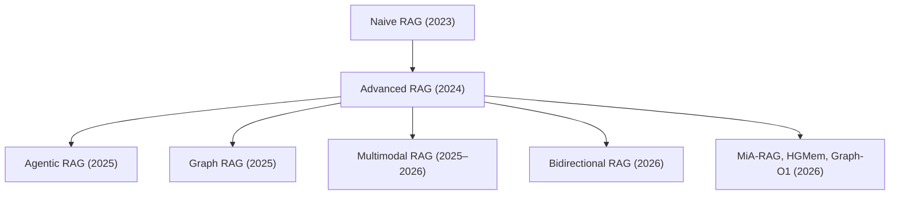
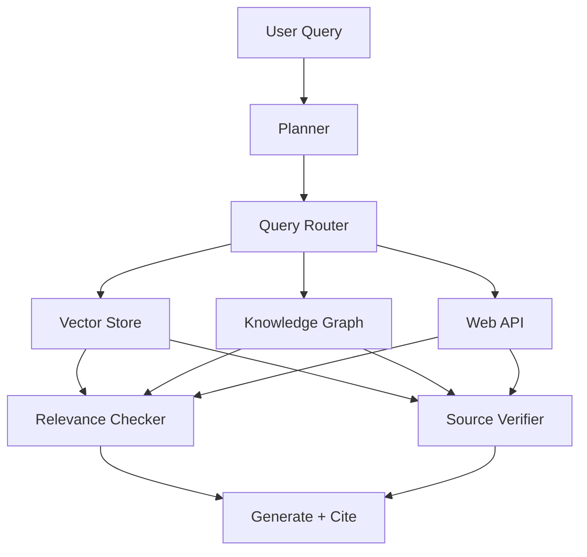
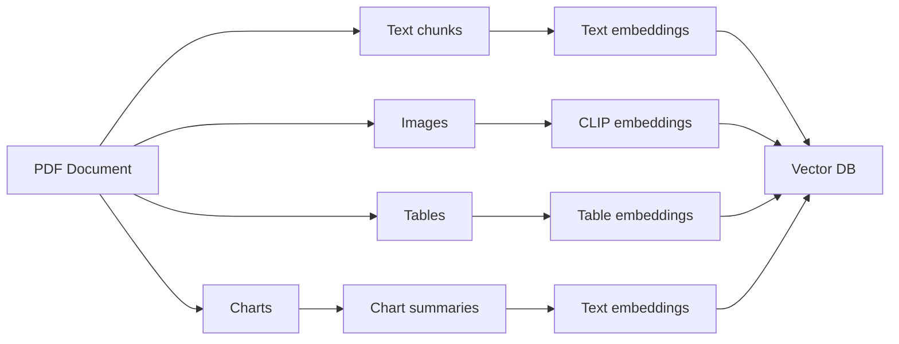
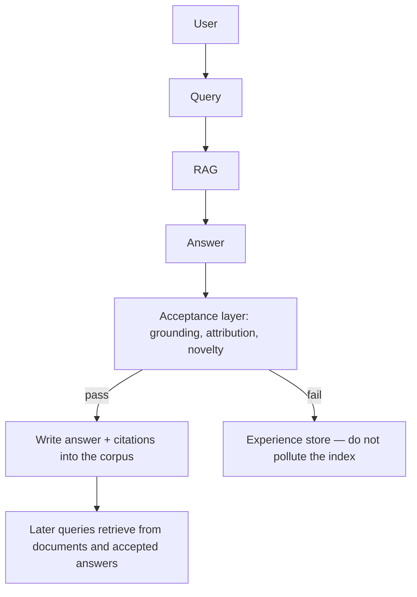
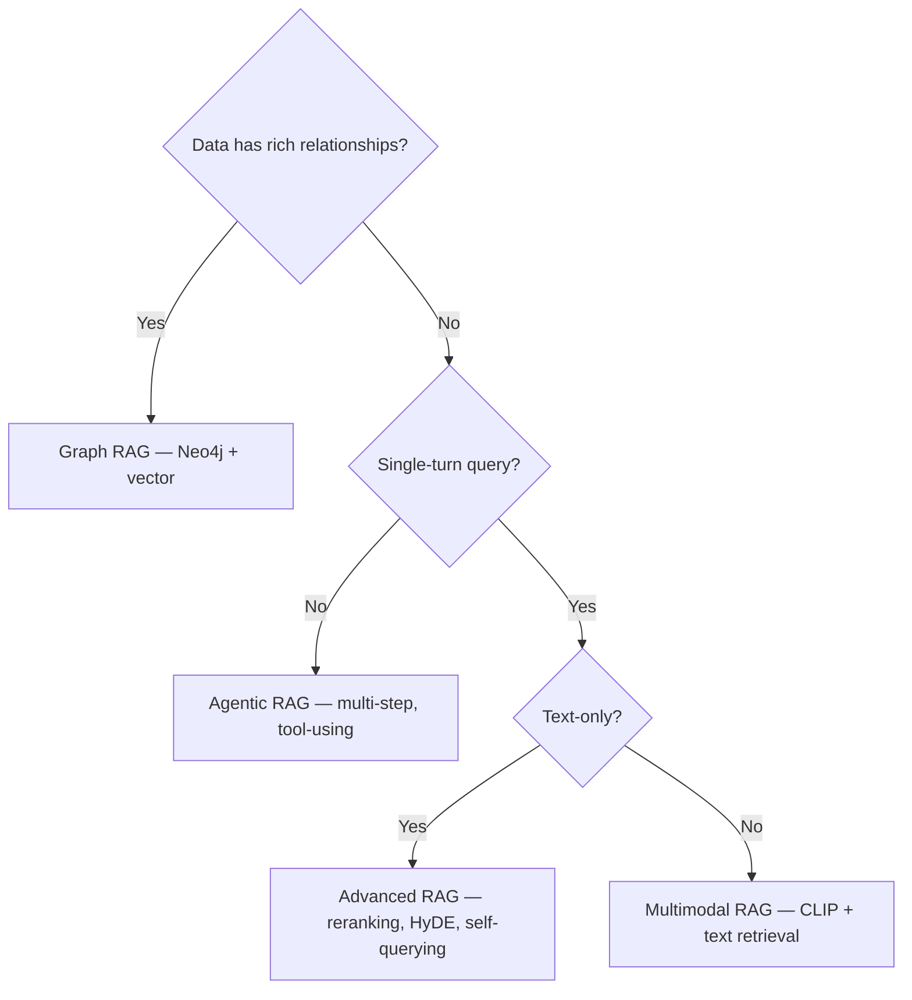

<div>
    <div style='display: inline-flex; list-style-type: none; padding-top: 15px;'>
        <li>
            
        </li>
    </div>
</div>

## RAG is Dead. Long Live RAG.

By 2026, Retrieval-Augmented Generation (RAG) is still the default way to ground LLMs in private data. Industry write-ups commonly cite **large drops in hallucination** and **gains in factual accuracy** versus ungrounded generation ([AI Discovery Digest, 2026](https://aidiscoverydigest.com/tutorials/retrieval-augmented-generation-what-changed-and-what-works/)). Those numbers vary by domain and retrieval quality — RAG is not a guarantee. Stanford's audits of legal RAG tools still found double-digit hallucination rates, and a 2025 medical study showed that *bad retrieval can make answers worse*.

The simple pattern of "chunk documents → embed → store in vector DB → retrieve top-K → inject into prompt" no longer cuts it for production. Enterprise deployments face three gaps that basic RAG cannot bridge ([Squirro, 2026](https://squirro.com/squirro-blog/state-of-rag-genai)):

1. **Real-time data access** — without the delays of traditional ingestion pipelines
2. **Knowledge graph integration** — retrieving interconnected facts, not only the most similar chunks
3. **Granular access control** — so the AI platform does not become a vector for data leakage

<!--more-->

Let's look at the RAG variants that have emerged to close those gaps.

---

## The RAG Evolution: A Quick Taxonomy



---

## 1. Agentic RAG — The Breakthrough of 2025–2026

Agentic RAG is the most important production shift. Instead of a single retrieve-then-generate step, an **agent** reasons about *what* to retrieve, *when* to retrieve, and *how* to use what it finds.

### How It Works



The planner decomposes the question. The router picks tools. Retrieved evidence is checked for relevance and attribution before the model writes a cited answer. That loop is what separates a demo from a system you can put in front of customers.

### Code Example with LangChain

```python
from langchain.agents import create_openai_tools_agent, AgentExecutor
from langchain.tools import Tool
from langchain_openai import ChatOpenAI

def query_vector_store(query: str) -> str:
    """Retrieve relevant documents from the vector database."""
    docs = vectorstore.similarity_search(query, k=5)
    return "\n\n".join(doc.page_content for doc in docs)

def query_knowledge_graph(query: str) -> str:
    """Query the Neo4j knowledge graph for structured relationships."""
    # Parameterized Cypher — never interpolate user input into the query string
    return kg.query(
        "MATCH (n)-[r]->(m) WHERE n.name CONTAINS $query RETURN n, r, m LIMIT 10",
        params={"query": query},
    )

tools = [
    Tool(name="vector_search", func=query_vector_store, description="Search internal documents"),
    Tool(name="knowledge_graph", func=query_knowledge_graph, description="Query entity relationships"),
]

agent = create_openai_tools_agent(
    llm=ChatOpenAI(model="gpt-4o"),
    tools=tools,
    prompt=system_prompt,  # ChatPromptTemplate: gather evidence before answering
)
executor = AgentExecutor(agent=agent, tools=tools)
```

**When to use**: Complex queries that need multi-source retrieval, reasoning over retrieved content, and fact verification.

---

## 2. Graph RAG — Beyond Semantic Similarity

Vector search finds semantically similar text. It misses **structured relationships** — "Who works for whom?", "What drug interacts with what condition?", "Which regulation applies to this scenario?"

Graph RAG combines vector search with **knowledge graph traversal**:

```python
import os
from langchain_community.graphs import Neo4jGraph
from langchain_community.vectorstores import Chroma

graph = Neo4jGraph(
    url=os.getenv("NEO4J_URL", "bolt://localhost:7687"),
    username=os.getenv("NEO4J_USER", "neo4j"),
    password=os.getenv("NEO4J_PASSWORD"),
)
vector_db = Chroma(embedding_function=embeddings, persist_directory="./chroma_db")

def hybrid_retrieve(query: str, k_vector: int = 5, k_graph: int = 3):
    docs = vector_db.similarity_search(query, k=k_vector)
    entities = extract_entities(query)  # NER-based

    cypher = """
    MATCH (e:Entity)-[r:RELATES_TO]-(neighbor)
    WHERE e.name IN $entities
    RETURN e, r, neighbor
    LIMIT $k_graph
    """
    graph_results = graph.query(
        cypher,
        params={"entities": entities, "k_graph": k_graph},
    )
    return format_context(docs, graph_results)
```

**When to use**: Enterprise knowledge bases, legal/regulatory documents, biomedical research — any domain with rich entity relationships.

---

## 3. Multimodal RAG — Text is Not Enough

By 2026, documents contain images, tables, charts, and diagrams. Multimodal RAG retrieves and reasons across **all modalities**:



```python
from transformers import CLIPProcessor, CLIPModel
from PIL import Image

clip_model = CLIPModel.from_pretrained("openai/clip-vit-large-patch14")
clip_processor = CLIPProcessor.from_pretrained("openai/clip-vit-large-patch14")

def embed_image(image_path: str):
    image = Image.open(image_path)
    inputs = clip_processor(images=image, return_tensors="pt")
    return clip_model.get_image_features(**inputs)

def embed_query(query: str):
    inputs = clip_processor(text=query, return_tensors="pt")
    return clip_model.get_text_features(**inputs)

def retrieve(query: str, k: int = 5):
    query_embedding = embed_query(query)
    text_results = text_vector_db.search(query, k=k // 2)
    image_results = image_vector_db.search(query_embedding, k=k // 2)
    return merge_and_rank(text_results, image_results, query_embedding)
```

**When to use**: Technical documentation, research papers, medical records, e-commerce catalogs.

---

## 4. Bidirectional RAG — Retrieval Goes Both Ways

Most RAG systems only read from a static index. **Bidirectional RAG** ([Chinthala, 2025](https://arxiv.org/abs/2512.22199)) also writes validated answers *back* into the corpus:



Naive write-back is dangerous: one hallucinated answer becomes tomorrow's "source." The paper's point is the **acceptance layer** — NLI grounding, citation checks, and novelty detection — so the knowledge base grows without poisoning itself.

---

## 5. MiA-RAG, HGMem, Graph-O1 — The Cutting Edge

Three 2025–2026 papers worth knowing by their actual names:

| Variant | What it actually is | Use case |
|---------|---------------------|----------|
| **MiA-RAG** | *Mindscape-Aware* RAG — builds a hierarchical global summary ("mindscape") and conditions both retrieval and generation on it ([Li et al., 2025](https://arxiv.org/abs/2512.17220)) | Long documents, narrative QA, GraphRAG-style node retrieval |
| **HGMem** | *Hypergraph* working memory — memory points as hyperedges that evolve during multi-step RAG ([arXiv:2512.23959](https://arxiv.org/abs/2512.23959)) | Multi-hop questions, persistent agents, complex relational modeling |
| **Graph-O1** | Agentic GraphRAG with Monte Carlo Tree Search + RL so the model explores only relevant subgraphs ([Liu, 2025](https://arxiv.org/abs/2512.17912)) | QA over text-attributed graphs (science, biomedical, e-commerce) |

---

## RAG Evaluation: How Do You Know It's Working?

A production RAG system needs evaluation, not vibes. Ragas is still a practical starting point:

```python
from ragas import evaluate
from ragas.metrics import (
    faithfulness,
    answer_relevancy,
    context_precision,
    context_recall,
)

results = evaluate(
    dataset=eval_dataset,
    metrics=[
        faithfulness,       # Is the answer grounded in the retrieved context?
        answer_relevancy,   # Does the answer address the question?
        context_precision,  # How much of the retrieved context is relevant?
        context_recall,     # Did we retrieve all relevant context?
    ],
)
print(results)
```

| Metric | What it measures | Practical target |
|--------|------------------|------------------|
| **Faithfulness** | Claim → evidence alignment | > 0.90 |
| **Answer Relevancy** | Question → answer relevance | > 0.85 |
| **Context Precision** | Signal-to-noise in retrieved chunks | > 0.80 |
| **Context Recall** | Coverage of relevant information | > 0.85 |

Treat those targets as starting points. Legal, medical, and customer-support corpora will need their own gold sets.

---

## Choosing the Right RAG Architecture



---

## Getting Started: Production RAG in 50 Lines

```python
# requirements: langchain, chromadb, openai, sentence-transformers
from langchain_community.vectorstores import Chroma
from langchain_community.embeddings import HuggingFaceEmbeddings
from langchain_openai import ChatOpenAI
from langchain.retrievers import ContextualCompressionRetriever
from langchain.retrievers.document_compressors import LLMChainExtractor

embeddings = HuggingFaceEmbeddings(model_name="BAAI/bge-large-en-v1.5")

vectorstore = Chroma(
    collection_name="knowledge_base",
    embedding_function=embeddings,
    persist_directory="./chroma_db",
)

llm = ChatOpenAI(model="gpt-4o")
compressor = LLMChainExtractor.from_llm(llm)
compression_retriever = ContextualCompressionRetriever(
    base_compressor=compressor,
    base_retriever=vectorstore.as_retriever(search_kwargs={"k": 10}),
)

query = "What are the key differences between Kafka and Pulsar?"
compressed_docs = compression_retriever.invoke(query)

context = "\n\n".join(doc.page_content for doc in compressed_docs)
answer = llm.invoke(f"Context:\n{context}\n\nQuestion: {query}\nAnswer:")
```

---

## What's Next for RAG

- **Streaming RAG** — retrieval from live data streams (Kafka → vector index → LLM)
- **Federated RAG** — retrieval across org boundaries with access control
- **Self-healing RAG** — automatic pipeline and chunking adjustments
- **Multilingual RAG** — cross-lingual retrieval with language-agnostic embeddings

---

## References

- [TuringPost — 20 Advanced RAG Types in 2026](https://www.turingpost.com/p/ragtypes)
- [Squirro — State of RAG & GenAI 2026](https://squirro.com/squirro-blog/state-of-rag-genai)
- [Techment — RAG in 2026: Enterprise AI](https://www.techment.com/blogs/rag-in-2026/)
- [AI Discovery Digest — RAG in 2026: What Changed](https://aidiscoverydigest.com/tutorials/retrieval-augmented-generation-what-changed-and-what-works/)
- [arXiv — Comprehensive Survey of RAG Architectures (2025)](https://arxiv.org/html/2506.00054v1)
- [Ragas — RAG Evaluation Framework](https://docs.ragas.io/)
- [MiA-RAG — Mindscape-Aware RAG (arXiv:2512.17220)](https://arxiv.org/abs/2512.17220)
- [HGMem — Hypergraph Working Memory (arXiv:2512.23959)](https://arxiv.org/abs/2512.23959)
- [Graph-O1 — MCTS + RL for graph reasoning (arXiv:2512.17912)](https://arxiv.org/abs/2512.17912)
- [Bidirectional RAG — validated write-back (arXiv:2512.22199)](https://arxiv.org/abs/2512.22199)

---

*This post is part of a series on 2026 AI trends. Check out the companion piece on [Multi-Agent Systems in 2026](/posts/multi-agent-systems-2026/).*
