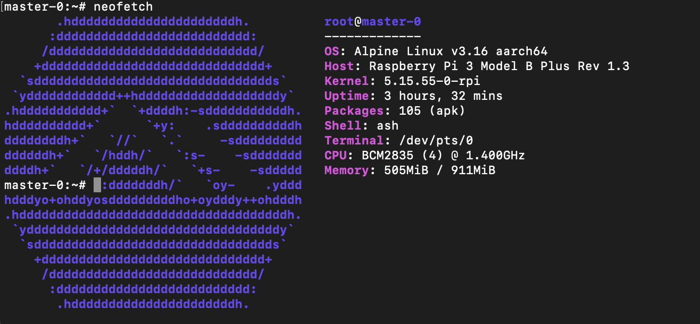

<div>
    <div style='display: inline-flex; list-style-type: none; padding-top: 15px;'>
        <li>
            
        </li>
    </div>
</div>

Vietnamese version can be read at [Vie-Ver](https://viblo.asia/p/install-k3s-on-raspberry-pi-alpine-linux-part1-bXP4WPbpJ7G).
<div style='padding-top:20px; display: inline-flex; white-space:nowrap;'>
    <span>A couple of days ago, Interesting. I cleaned warehouse and found out two raspberries</span> 
    
</div>
 <span>one is 3b+ and the other is 4B. It's also a pity to quit, so spending some free time creating <span style='color:white; background-color: black;'>k3s cluster</span> to play around. Making it difficult for myself, I decided to install <span style='color:white; background-color: black;'>alpine linux</span> for them.</span>


 
    
### Setup OS

1. [Download](https://alpinelinux.org/downloads/) the Raspberry Pi build.
- **Which version should I install?**

    There are currently three versions of Alpine for Raspberry Pi: `armhf`, `armv7`, and `aarch64`. The aarch64 build should be compatible Raspberry Pi 3 and Compute Module 3, and Raspberry Pi 4 Model B. i will choice `aarch64`.

    ```sh
    cd /tmp
    wget https://dl-cdn.alpinelinux.org/alpine/v3.16/releases/aarch64/alpine-rpi-3.16.2-aarch64.tar.gz
    ```

2. Partition and format the memory card.
    
    I using `Raspbian` to create `usb` alpine `boot` for rpi. Install [GNU Parted](https://www.gnu.org/software/parted/) (parted) if not available.

    ```sh
    sudo apt install parted
    ```

    First of all Insert the SD card and check it have been existed. My sd card is `sda`.

    ```sh
    $ lsblk
    NAME        MAJ:MIN RM  SIZE RO TYPE MOUNTPOINT
    sda           8:0    1 58.2G  0 disk 
    `-sda1        8:1    1 58.2G  0 part /media/pi/SDCARD
    mmcblk0     179:0    0 29.7G  0 disk 
    |-mmcblk0p1 179:1    0  256M  0 part /boot
    `-mmcblk0p2 179:2    0 29.5G  0 part /
    ```

    <!-- Before formatting the drive, you can securely wipe out all the data on it by overwriting the entire drive with random data. This ensures that the data cannot be recovered by any data recovery tool.
    ```sh
    $ sudo dd if=/dev/zero of=/dev/sda bs=4096 status=progress
    3726401536 bytes (3.7 GB, 3.5 GiB) copied, 10 s, 373 MB/s
    dd: error writing '/dev/sdb': No space left on device
    958541+0 records in
    958540+0 records out
    3926179840 bytes (3.9 GB, 3.7 GiB) copied, 10.5757 s, 371 MB/s
    ``` -->

    Create a small partition for `/boot`, then allocate the rest of the disk to a separate partition.

    ```sh
    sudo parted /dev/sda --script -- mklabel msdos
    sudo parted /dev/sda --script -- mkpart primary fat32 1 256M
    sudo parted /dev/sda --script -- mkpart primary ext4 256M 100%
    ```

    Format the boot partition to `FAT32` and the rest is `ext4`:

    ```sh
    sudo parted /dev/sda --script -- set 1 boot on
    sudo parted /dev/sda --script -- set 1 lba on
    sudo mkfs.vfat -F32 /dev/sda1
    sudo mkfs.ext4 /dev/sda2
    ```

    Verify by printing the partition table.

    ```sh
    $ sudo parted /dev/sda --script print
    Model:  SD Card Reader (scsi)
    Disk /dev/sda: 62.5GB
    Sector size (logical/physical): 512B/512B
    Partition Table: msdos
    Disk Flags: 

    Number  Start   End     Size    Type     File system  Flags
    1      1049kB  256MB   255MB   primary  fat32        lba
    2      256MB   62.5GB  62.3GB  primary  ext4
    ```

3. Mount the boot partition.
    ```sh
    sudo mkdir /mnt/sd
    sudo mount /dev/sda1 /mnt/sd
    ```

4. Unpack the Alpine package onto the partition.
    ```sh
    # i have download alpine image at /tmp in step-1
    sudo tar xf /tmp/alpine-rpi-**.tar.gz -C /mnt/sd --no-same-owner
    ```

5. Create the `usercfg.txt` file into the boot partition: `/mnt/sd/usercfg.txt`.
    ```sh
    # Enable mini UART as serial port (/dev/ttyS0).
    # Also, fixes VideoCore IV (aka the GPU or the VPU) frequency to 250MHz.
    enable_uart=1

    # give the GPU the least amount of RAM it can get by with (16MB).
    # This also triggers the Pi to use a cutdown version of the firmware (start_cd.elf).
    gpu_mem=16

    # Optionally turn off audio and bluetooth.  (Note "dt" stands for device tree)
    dtparam=audio=off,pi3-disable-bt
    ```

6. Headless Installation (optional)

    If you don’t have direct access to your system, such as via a display and keyboard you can install Alpine with the overlay directory structure and [headless script](https://github.com/davidmytton/alpine-linux-headless-raspberrypi).

    ```sh
    sudo curl -L -o /mnt/sd/headless.apkovl.tar.gz https://github.com/davidmytton/alpine-linux-headless-raspberrypi/releases/download/2021.06.23/headless.apkovl.tar.gz
    ```

7. Wifi Configuration (optional)

    With the headless script installed. Create the `wifi.txt` into the boot partition: `/mnt/sd/wifi.txt`.

    ```sh
    ssid password
    ```

8. Unmount.
    ```sh
    sudo umount /mnt/sd
    ```

### Installation

1. Log in into Alpine with the default username and password. If you have a headless installation you can ssh into the Raspberry Pi.

    Default Alpine login credentials are username `root` with **empty password**.

2. Run setup.
    ```sh
    setup-alpine
    ```

3. Create system partitions.

    Resize the FAT32 partition to 1GB and use the remaining space to create a new primary bootable partition where Alpine Linux is gonna being installed.
    ```sh
    apk add e2fsprogs
    mkfs.ext4 /dev/mmcblk0p2
    mount /dev/mmcblk0p2 /mnt
    ```

4. Install the system files.

    ```sh
    setup-disk -m sys /mnt
    ```

    If you get `ext4 is not supported . Only supported are: vfat` error, run with `FORCE_BOOTFS` set.

    ```sh
    FORCE_BOOTFS=1 setup-disk -m sys /mnt
    ```

5. Remount old partition in RW. An update in the first partition is required for the next reboot.

    ```sh
    mount -o remount,rw /media/mmcblk0p1
    ```

6. Clean up the boot folder in the first partition to drop unused files.

    ```sh
    rm -f /media/mmcblk0p1/boot/*
    cd /mnt
    rm boot/boot
    ```

7. Move the image and init ram for Alpine Linux into the right place.

    ```sh
    mv boot/* /media/mmcblk0p1/boot
    rm -Rf boot
    mkdir media/mmcblk0p1 # It's the mount point for the first partition on the next reboot
    ```

8. Update /etc/fstab:
    ```sh
    echo "/dev/mmcblk0p1 /media/mmcblk0p1 vfat defaults 0 0" >> etc/fstab
    sed -i '/cdrom/d' etc/fstab
    sed -i '/floppy/d' etc/fstab
    ```

9. Enable edge repository.

    ```sh
    sed -i '/edge/s/^#//' /mnt/etc/apk/repositories
    ```

10. For the next boot, indicate that the root filesystem is on the second partition. If the cmdline.txt file contains a line that starts with /root, then use sed:

    ```sh
    sed -i 's/$/ root=\/dev\/mmcblk0p2 /' /media/mmcblk0p1/cmdline.txt
    ```

11. Make sure that appropriate cgroups are enabled

    ```sh
    sed -i "s/$/ cgroup_enable=cpuset cgroup_enable=memory cgroup_memory=1/" /media/mmcblk0p1/cmdline.txt
    ```

12. If using chrony, allow the system clock to be stepped in the first three updates if its offset is larget than 1 second.

    ```sh
    echo "makestep 1.0 3" >> /etc/chrony/chrony.conf
    ```

13. Reboot

Continue read Part 2 (Install K3s on Alpine) at [Raspberry Pi K3s Alpine Linux Part 2](/posts/raspberry-pi-k3s-alpine-linux-part-2/)