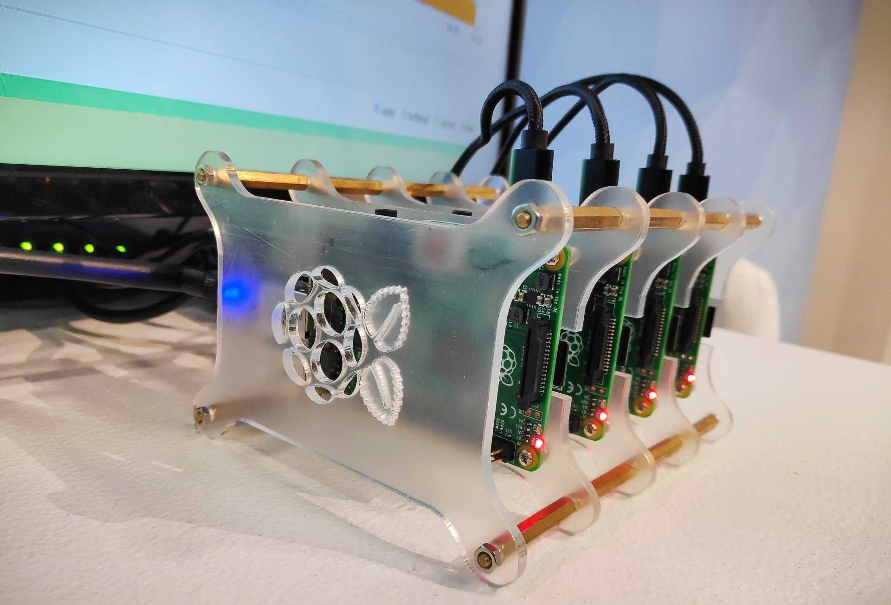
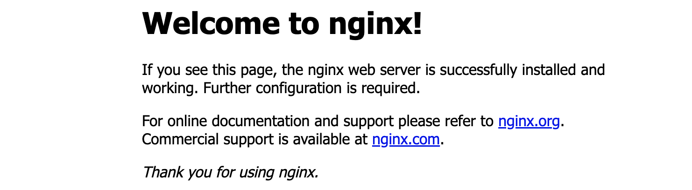

Continue part 2 of [Raspberry Pi K3s Alpine Linux Part 1](/posts/raspberry-pi-k3s-alpine-linux-part-1/). Now we are going to deploy `K3s` (a light version of Kubernetes) on **Raspberry Pi**.



### Setup Kubernetes

<div style='padding-top:20px; display: inline-flex; white-space:nowrap;'>
    <span>Update alpine and install curl, wget if your</span> 
    
    <span style='padding-left: 15px'>don't have it!.</span>
</div>

```sh
apk update
apk add curl wget
```

Setup [Static IP](https://www.linuxshelltips.com/static-ip-address-alpine-linux/) address to **192.168.1.100** for master node with **255.255.255.0 (/24)** subnet. The default gateway set to **192.168.0.100**:

```sh
vi /etc/network/interfaces
```
```vim
auto eth0
iface eth0 inet static
        address 192.168.0.100
        netmask 255.255.255.0
        gateway 192.168.0.1
```

Remove `wpa_supplicant` change to `wireguard` because By default, K3s will run with `flannel` as the `CNI`, using `VXLAN` as the default backend [More](https://docs.k3s.io/installation/network-options).


```sh
apk del wpa_supplicant
swapoff -a
free -m
apk add wireguard-tools
modprobe wireguard
```

Edit `/etc/module` and add `wireguard` in last line.

```sh
af_packet
ipv6
wireguard
```

Reboot to load wireguard.
```sh
reboot
```

K3s is installed through a bash script that performs all the actions in the background without user input. Open the console of your Alpine Linux and run the command below. We also push option include `--flannel-backend=wireguard`, `--disable-cloud-controller`, and `--no-deploy traefik` (i want to using ingress-nginx).

```sh
curl -sfL https://get.k3s.io | INSTALL_K3S_EXEC="--no-deploy traefik --flannel-backend=wireguard --node-taint CriticalAddonsOnly=true:NoExecute --disable-cloud-controller" sh -s -
```

Command execution output:

```vim
[INFO]  Finding release for channel stable
[INFO]  Using v1.24.6+k3s1 as release
[INFO]  Downloading hash https://github.com/k3s-io/k3s/releases/download/v1.24.6+k3s1/sha256sum-arm64.txt
[INFO]  Downloading binary https://github.com/k3s-io/k3s/releases/download/v1.24.6+k3s1/k3s-arm64
[INFO]  Verifying binary download
[INFO]  Installing k3s to /usr/local/bin/k3s
[INFO]  Skipping installation of SELinux RPM
[INFO]  Creating /usr/local/bin/kubectl symlink to k3s
[INFO]  Creating /usr/local/bin/crictl symlink to k3s
[INFO]  Creating /usr/local/bin/ctr symlink to k3s
[INFO]  Creating killall script /usr/local/bin/k3s-killall.sh
[INFO]  Creating uninstall script /usr/local/bin/k3s-uninstall.sh
[INFO]  env: Creating environment file /etc/rancher/k3s/k3s.env
[INFO]  openrc: Creating service file /etc/init.d/k3s
[INFO]  openrc: Enabling k3s service for default runlevel
[INFO]  openrc: Starting k3s
 * Caching service dependencies ...                                                                 [ ok ]
 * Mounting cgroup filesystem ...                                                                   [ ok ]
 * Starting k3s ...                                                                                 [ ok ]
```

Confirm a list of running services:

```sh
$ rc-status
Runlevel: default
 crond                                                                                                                                     [  started  ]
 acpid                                                                                                                                     [  started  ]
 haveged                                                                                                                                   [  started  ]
 net-online                                                                                                                                [  started  ]
 k3s                                                                                                                           [  started 00:01:22 (0) ]
 qemu-guest-agent                                                                                                                          [  started  ]
 sshd                                                                                                                                      [  started  ]
Dynamic Runlevel: hotplugged
Dynamic Runlevel: needed/wanted
 sysfs                                                                                                                                     [  started  ]
 fsck                                                                                                                                      [  started  ]
 root                                                                                                                                      [  started  ]
 localmount                                                                                                                                [  started  ]
 cgroups                                                                                                                                   [  started  ]
Dynamic Runlevel: manual
```

Check Cluster nodes status:

```sh
$ sudo kubectl get nodes
```

**Note:** `worker` node need token from `master token`.

```sh
# ssh to master-0 and get token by command below
cat /var/lib/rancher/k3s/server/node-token 
```

Install agent node. The command to add additional node will look similar to this:
```sh
curl -sfL https://get.k3s.io | K3S_TOKEN="K10efd2f698fc0..." K3S_URL="https://192.168.0.100:6443" sh -
```

Check Cluster!
```sh
$ kubectl get nodes
NAME       STATUS   ROLES                  AGE     VERSION
master-0   Ready    control-plane,master   3h25m   v1.24.6+k3s1
worker-1   Ready    <none>                 126m    v1.24.6+k3s1

```

Install [Ingress-Nginx](https://kubernetes.github.io/ingress-nginx/deploy/).
```sh
kubectl apply -f https://raw.githubusercontent.com/kubernetes/ingress-nginx/controller-v1.4.0/deploy/static/provider/cloud/deploy.yaml
```

Check Ingress.
```sh
$ kubectl get pod,svc -n ingress-nginx
NAME                                            READY   STATUS      RESTARTS   AGE
pod/ingress-nginx-admission-create-9lbtz        0/1     Completed   0          21m
pod/ingress-nginx-admission-patch-j9hs9         0/1     Completed   1          21m
pod/ingress-nginx-controller-598d7c8b88-hfx7n   1/1     Running     0          21m

NAME                                         TYPE           CLUSTER-IP     EXTERNAL-IP                   PORT(S)                      AGE
service/ingress-nginx-controller-admission   ClusterIP      10.43.39.71    <none>                        443/TCP                      21m
service/ingress-nginx-controller             LoadBalancer   10.43.48.244   192.168.0.100,192.168.0.101   80:31710/TCP,443:30835/TCP   21m
```

<div style='padding-top:20px'></div>

### Test Cluster

<div style='padding-top:20px'></div>
Test Ingress helo world. Create the file `hello.yaml` and populate it with this code:

``` yaml
apiVersion: apps/v1
kind: Deployment
metadata:
  name: docker-hello-world
  labels:
    app: docker-hello-world
spec:
  selector:
    matchLabels:
      app: docker-hello-world
  replicas: 1
  template:
    metadata:
      labels:
        app: docker-hello-world
    spec:
      containers:
      - name: docker-hello-world
        image: arm64v8/nginx
        ports:
        - containerPort: 80
---
apiVersion: v1
kind: Service
metadata:
  name: docker-hello-world-svc
spec:
  selector:
    app: docker-hello-world
  ports:
    - port: 8088
      targetPort: 80
  type: ClusterIP

---
apiVersion: networking.k8s.io/v1
kind: Ingress
metadata:
  name: hello-world-ing
  annotations:
    kubernetes.io/ingress.class: "nginx"
spec:
  tls:
  - secretName: tls-secret
  rules:
  - http:
      paths:
        - path: /
          pathType: Prefix
          backend:
            service:
              name: docker-hello-world-svc
              port:
                number: 8088
```

Create the resource by entering:
```sh
kubectl create -f ingress.yaml
```

Get status.
```sh
$ kubectl get pod,svc,ingress -n default
NAME                                      READY   STATUS    RESTARTS   AGE
pod/docker-hello-world-6bfd85ff8d-jmtvl   1/1     Running   0          53s

NAME                             TYPE        CLUSTER-IP      EXTERNAL-IP   PORT(S)    AGE
service/kubernetes               ClusterIP   10.43.0.1       <none>        443/TCP    3h45m
service/docker-hello-world-svc   ClusterIP   10.43.143.143   <none>        8088/TCP   53s

NAME                                        CLASS    HOSTS   ADDRESS                       PORTS     AGE
ingress.networking.k8s.io/hello-world-ing   <none>   *       192.168.0.100,192.168.0.101   80, 443   53s
```

Go to [http://192.168.0.100](http://192.168.100/)

Look good! :fire: :fire: :fire:

<div style='box-shadow: rgba(6, 24, 44, 0.4) 0px 0px 0px 2px, rgba(6, 24, 44, 0.65) 0px 4px 6px -1px, rgba(255, 255, 255, 0.08) 0px 1px 0px inset;'><div>
