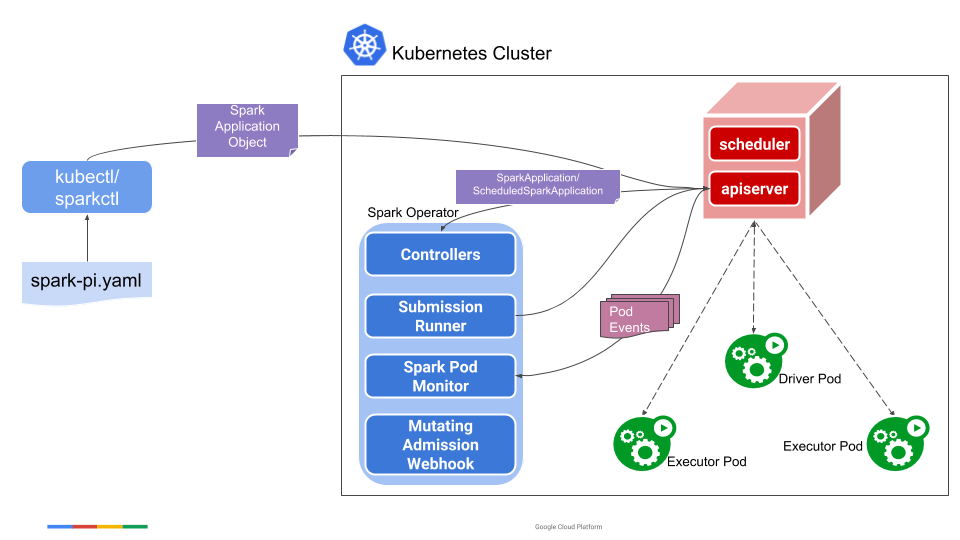

<div>
    <div style='display: inline-flex; list-style-type: none; padding-top: 15px;'>
        <li>
            
        </li>
    </div>
</div>


Spark Operator is a Kubernetes Operator designed for Spark. It aims to define and execute Spark applications as easily as other workloads on Kubernetes by using and managing Kubernetes custom resources (CRDs) to specify, run, and update the status of Spark applications.

To learn more, you can check out the [Design](https://github.com/kubeflow/spark-operator/blob/master/docs/design.md), [API Specification](https://github.com/kubeflow/spark-operator/blob/master/docs/user-guide.md), and [User Guide](https://github.com/kubeflow/spark-operator/blob/master/docs/user-guide.md) on GitHub.



## Why Choose Spark Operator

The Spark Operator simplifies the deployment and management of Spark applications on Kubernetes. It provides a declarative way to run Spark applications, handling the complexities of resource management, scheduling, and monitoring. This allows developers to focus on writing Spark code rather than managing the underlying infrastructure. Additionally, Spark Operator supports both batch and streaming workloads, making it versatile for various big data processing needs.

The Spark Operator offers a streamlined way to deploy and manage Spark applications on Kubernetes. Key benefits include:

- **Declarative Application Management:** Define Spark applications in YAML files, making it easy to manage and deploy applications using Kubernetes tools like kubectl.

- **Resource Management:** Automates the allocation of resources for Spark jobs, ensuring efficient use of cluster resources.

- **Versatility:** Supports both batch and streaming workloads, catering to a wide range of big data processing needs.
- **Simplified Monitoring:** Integrates with Kubernetes monitoring tools, providing better insights into job performance and resource utilization.


### How it Works

- Define the Spark Application in YAML: You create a YAML file that describes your Spark application. This file includes specifications such as the type of application (e.g., Python, Java), the Docker image to use, resource requirements for drivers and executors, and other configuration settings.

- Apply the YAML File Using kubectl: Once the YAML file is ready, you can use kubectl to apply this file to your Kubernetes cluster. The Spark Operator will then read this file, create the necessary Kubernetes resources, and manage the lifecycle of the Spark application.

## 1. Steps to Set Up Spark Operator with Kubernetes

### Prerequisites

Ensure you have the following before starting:

- A running Kubernetes cluster.
- `kubectl` command-line tool installed and configured.
- git installed on your local machine.

#### Step 1: Clone the Repository
Clone the repository containing the configuration and scripts needed to deploy the Spark Operator:
```
git clone https://github.com/dnguyenngoc/big-data.git
```

#### Step 2: Start the Spark Operator
Change your directory to the k8s folder and use the provided script `_start.sh` to deploy the Spark Operator. This script automates the setup process:
```
cd big-data/k8s
sh _start.sh spark-operator
```

#### Step 3: Verify Deployment
After deploying the Spark Operator, verify that the pods and stateful sets are running correctly in the spark-operator namespace:

```
kubectl get pod,statefulset -n spark-operator
```
The output should display the running pods and stateful sets associated with the Spark Operator.

## 2. Submit Application
A `SparkApplication` is essentially a `CRD` resource that can be applied to the cluster using `kubectl`, as shown in the example below:
```yaml
---
apiVersion: 'sparkoperator.k8s.io/v1beta2'
kind: SparkApplication
metadata:
  name: pyspark-pi
  namespace: spark-operator
spec:
  type: Python
  pythonVersion: '3'
  mode: cluster
  image: 'duynguyenngoc/spark:3.5.1'
  imagePullPolicy: Always
  mainApplicationFile: local:///opt/spark/examples/src/main/python/pi.py
  sparkVersion: '3.5.1'
  restartPolicy:
    type: OnFailure
    onFailureRetries: 3
    onFailureRetryInterval: 10
    onSubmissionFailureRetries: 5
    onSubmissionFailureRetryInterval: 20
  driver:
    cores: 1
    coreLimit: '1200m'
    memory: '512m'
    labels:
      version: 3.5.1
    serviceAccount: sparkoperator
  executor:
    cores: 1
    instances: 1
    memory: '512m'
    labels:
      version: 3.5.1
```

To submit this Spark Pi application to Kubernetes, simply use:

```sh
kubectl apply -f spark-pi.yaml
kubectl get sparkapp -n spark-operator
```